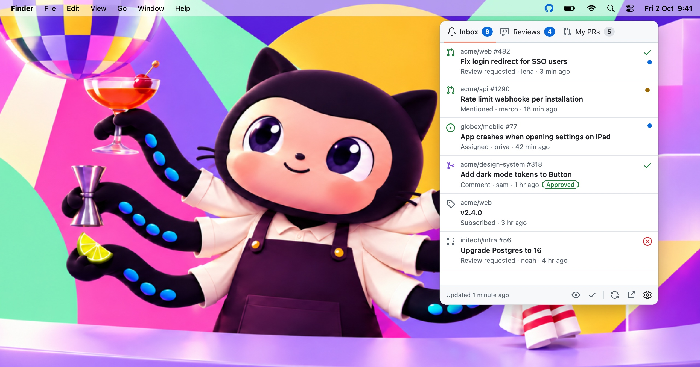

# GitHubBar

<picture>
  <source media="(prefers-color-scheme: dark)" srcset="docs/screenshots/hero-dark.jpg">
  
</picture>

<br>
<br>

GitHubBar is a simple macOS menubar app that keeps your GitHub notifications, pull requests and review requests one click away. Styled after GitHub's own [Primer](https://primer.style/) design system.

## Features

- Tabs for anything you want to watch: notifications, review requests, your pull requests, failing CI, or any GitHub search
- Presets for the common cases, or write your own query
- The menubar icon lights up when something needs your attention
- Pull requests show their state, CI status and review decision
- Mark notifications as read or done, one by one or a whole tab at once
- Optional macOS notifications when new items show up
- Snooze the highlight when you need to focus
- Keyboard shortcuts that match GitHub's inbox (`E`, `⇧I`, `J`/`K`), plus a global shortcut to open it
- Export and import your tabs to share them

## Installation

1. Download the latest `.dmg` from [Releases](https://github.com/elalemanyo/GitHubBar/releases)
2. Move `GitHubBar.app` to your Applications folder
3. Open the app - it will appear in your menubar

The app isn't notarized by Apple, so macOS blocks the first launch. Open **System Settings → Privacy & Security** and click **Open Anyway** (only once).

Or remove the quarantine flag in Terminal:

```sh
xattr -dr com.apple.quarantine /Applications/GitHubBar.app
```

GitHubBar keeps itself up to date with [Sparkle](https://sparkle-project.org). You can also use **Check for Updates…** in the gear menu.

## Setup

1. [Create a classic personal access token](https://github.com/settings/tokens/new?scopes=repo,notifications&description=GitHubBar) with the `repo` and `notifications` scopes
2. Click the GitHubBar icon in the menubar and open Settings
3. Paste the token and click **Save**

The token is stored in your Keychain. Fine-grained tokens work for search tabs, but GitHub doesn't let them read notifications.

## Usage

- **Click** an item to open it on GitHub (notifications are marked as read)
- **Hover** a notification to mark it as read or done
- **Right-click** an item for more actions (copy link, mark as read or done)
- Press **`?`** in the popover to see all keyboard shortcuts

### Tabs

Every tab has a title, an icon and a query. Add, edit and reorder them in **Settings → Tabs**.

Not sure how to write a query? Click **Copy AI Prompt** in the tab editor, paste it into your AI assistant, describe what you want to see, and paste the answer back.

**Search tabs** use the same syntax as the search bar on github.com, for example `is:pr is:open review-requested:@me`. See [GitHub's search syntax](https://docs.github.com/en/search-github/searching-on-github/searching-issues-and-pull-requests).

**Notification tabs** filter your unread notifications:

| Qualifier | Example |
|---|---|
| `reason:` | `reason:review_requested`, `reason:mention,team_mention` |
| `type:` | `type:pr`, `type:Issue`, `type:Release`, `type:ci` |
| `state:` | `state:open`, `-state:merged,closed` |
| `repo:` | `repo:owner/name` |
| `org:` | `org:owner` |

Commas mean "any of", a leading `-` excludes, and plain words match the title. See the [notification reasons](https://docs.github.com/en/rest/activity/notifications#about-notification-reasons).

### Keyboard shortcuts

| Keys | Action |
|---|---|
| `⌘1`–`⌘9`, `←` `→` | Switch tab |
| `J` / `↓`, `K` / `↑` | Next / previous item |
| `O` / `↩` | Open in browser |
| `⌘↩` / `⌘`-click | Open in a background tab (keeps the popover open) |
| `E` | Mark notification as done |
| `⇧I` | Mark notification as read |
| `⌘R` | Refresh |
| `?` | Show shortcuts |
| `Esc` | Close |

Set a global shortcut to open GitHubBar from anywhere in **Settings → Account**.

## Requirements

- macOS 14.0 (Sonoma) or later

## Contributing

Ideas, bug reports and pull requests are all welcome. If something doesn't work or you'd love a new feature, [open an issue](https://github.com/elalemanyo/GitHubBar/issues) and let's talk about it.

To run it locally you need Xcode and [XcodeGen](https://github.com/yonaskolb/XcodeGen):

```sh
brew install xcodegen
xcodegen generate
open GitHubBar.xcodeproj   # then press ⌘R
```

A quick map of the code:

- `GitHubBar/Core/` - GitHub client (REST + GraphQL), Keychain, notification filter, system notifications
- `GitHubBar/Store/` - app state: polling, results, attention logic
- `GitHubBar/UI/` - popover, settings, and Primer-style components
- `scripts/` - helpers to build the DMG, update the bundled [Octicons](https://primer.style/octicons/), render the app icon and the screenshots
- `docs/` - the [website](https://elalemanyo.github.io/GitHubBar/) (GitHub Pages)

Screenshots on the website and in this README come from the real app with demo data: `scripts/make-screenshots.sh` renders them (light and dark) into `docs/screenshots/`. Rerun it after UI changes.

### Releasing

Push a tag and GitHub Actions does the rest:

```sh
git tag v0.2.0 && git push origin v0.2.0
```

The workflow builds a universal DMG (`scripts/make-dmg.sh`), signs it for Sparkle and writes `appcast.xml` (`scripts/make-appcast.sh`), then publishes both on the GitHub release. Installed apps find the update through `releases/latest/download/appcast.xml`. Tags with a `-` (like `v0.2.0-beta.1`) become pre-releases, which installed apps ignore.

Updates are signed with a Sparkle EdDSA key: the public key is `SPARKLE_PUBLIC_KEY` in `project.yml` (Release builds only, so Debug builds from Xcode never check for updates), the private key is the `SPARKLE_PRIVATE_KEY` repository secret.

Not sure where to start? Small things help too: trying new queries, improving the docs, or sharing your favorite tabs.

## License

[MIT](LICENSE)
